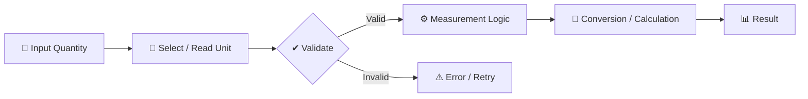
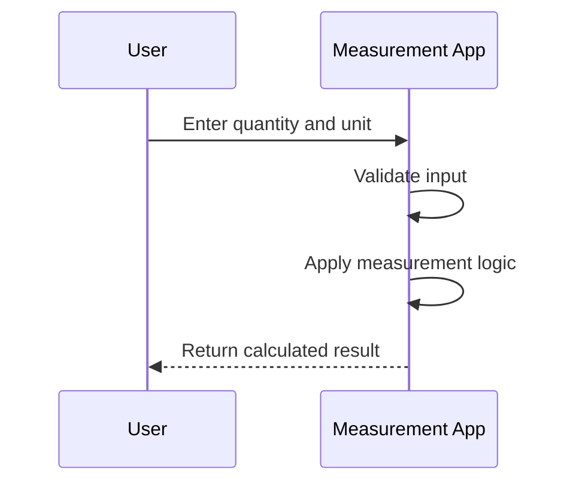
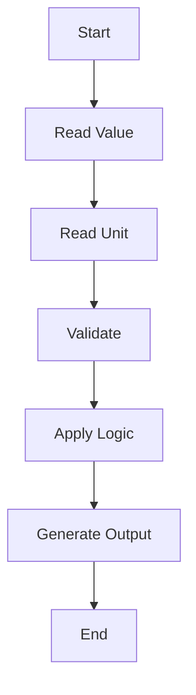
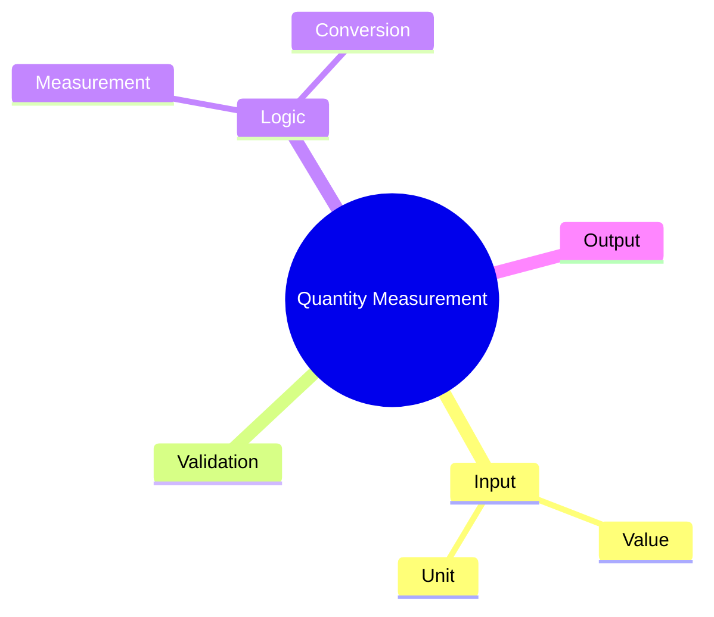

# 📏 Quantity Measurement App

<p align="center"><b>A Java application for modelling quantities, units, validation, and measurement-oriented operations.</b></p>

<p align="center">


</p>

---

## ✨ Overview

**Quantity Measurement App** explores how an application can represent a quantity, associate it with a unit, validate the supplied values, and apply measurement or conversion logic to produce a meaningful result.

The core idea is simple but highly reusable: **take a value + unit, process it through consistent logic, and return an understandable output**.

## 🎯 Core Capabilities

| Area | Purpose |
|---|---|
| 🔢 Quantity Input | Accept a measurement value |
| 📐 Unit Handling | Associate values with measurement units |
| ✔️ Validation | Check whether input can be processed |
| ⚙️ Logic | Apply measurement or conversion rules |
| 📊 Output | Present the resulting value or comparison |

## 🏗️ Conversion Architecture



## 🔄 How It Works



## 🧠 Processing Pipeline



## 📂 Project Structure

```text
QuantityMeasurementApp/
├── src/
│   └── Java source files
└── README.md
```

## 🚀 Run Locally

### Requirements
- Java Development Kit (JDK)

Compile the Java source inside `src/`:

```bash
javac src/*.java
```

Run the class containing the `main` method using your IDE or terminal.

## 🗺️ Project Map



## 💡 What You Can Learn From It

- Object-oriented modelling of real-world quantities
- Unit-aware program design
- Validation and comparison logic
- Java application structure
- Breaking calculations into reusable steps

## 🔮 Future Improvements

- [ ] Support additional measurement categories
- [ ] Add richer unit conversion options
- [ ] Add automated tests
- [ ] Add a graphical interface
- [ ] Support persistent conversion history

---

### 👨‍💻 Created by **Priyanshu**

⭐ If this project helped you, give the repo a star!
